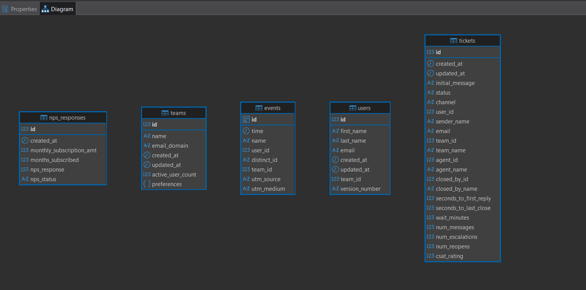

# SQL-Agentic-AI-using-LangChain

# Langchain

The SQL Agent provided by LangChain is a tool that allows you to interact with SQL databases using natural language. It is designed to be more 
flexible and more powerful than the standard SQLDatabaseChain, and it can be used to answer more general questions about a database, as well as recover from errors.

Here are some of the advantages of using the SQL Agent:

- It can answer questions based on the databases' schema as well as on the databases' content (like describing a specific table)
- It can recover from errors by running a generated query, catching the traceback and regenerating it correctly.
- It is compatible with any SQL dialect supported by SQLAlchemy and TypeORM (e.g., MySQL, PostgreSQL, Oracle SQL, Databricks, SQLite).


```
Example prompt used: "Tell me name of all the teams?"
```
### Output

```
> Entering new SQLDatabaseChain chain...
Tell me name of all the teams?
SQLQuery:SELECT "name" FROM teams;
SQLResult: [('VentureSkill',), ('Designfix',), ('Sprouter',), ('Jiffybake',), ('Fitnesse',), ('Bakersloaf',), ('Brewpods',), ('CHORDER',), ('Wearcade',), ('band.ly',), ('Cloudworking',), ('BASEWORK',), ('Cycline',), ('Arborlily',), ('Investmentwing',), ('Craftgrade',), ('GardenBulb',), ('Craftyfashion',), ('Shirtbag',), ('Lunchkit',), ('Readybrewer',), ('Couturespot',), ('Ebase',), ('Cavawear',), ('KNITTERY',), ('Cookbright',), ('Bakelane',), ('Conder',), ('Weavel',), ('Luckydogs',), ('dbase',), ('Craftlux',), ('Loanix',), ('backyard.ly',), ('Yobbit',), ('Investstack',), ('cake.ly',), ('Snoodle',), ('Designerminds',), ('cookStack',), ('GuapoDog',), ('Catboy',), ('Stacksensor',), ('Lagerly',), ('Fitnest',), ('Pnexus',), ('Protools',), ('Talkrabbit',), ('sportflip',), ('Yumfashion',), ('Zenwear',), ('Babyfox',), ('Expressrabbit',), ('Fashionglance',), ('Gamedust',), ('Bakenatural',), ('Wearsy',), ('Gamecaliber',), ('Wigglebiscuit',), ('Bakely',), ('Cardfinance',), ('CRAFTERY',), ('Launchband',), ('Seedling',), ('Upband',), ('Gamesauce',), ('Nextblossom',), ('Remotehack',), ('Soundcast',), ('Picview',), ('Virtualbox',), ('Moochimp',), ('Sweatery',), ('Croczo',), ('RabbitJump',), ('Famouse',), ('Imagezip',), ('Flowera',), ('Petalan',), ('utopiary',), ('Seedmetrics',), ('Sproutleaf',), ('dinner.ly',), ('Workhook',), ('Bandjet',), ('Smark',), ('athletic.io',), ('Appdashly',), ('Carbonflower',), ('StrawberryWhale',), ('Wabbit',), ('Brewdive',), ('lunch.ly',), ('dogshare',), ('Investloft',), ('Designfork',), ('Clothesy',), ('handmade.ly',), ('Bitax',), ('garden.ly',), ('Cointech',), ('Fitnessup',), ('Homebeer',), ('Lunchbag',), ('Poodler',), ('Songwise',), ('Designercrowd',), ('Snacket',), ('metavideo',), ('Cookfully',), ('Goaldog',), ('Financero',), ('Candidfashion',), ('Brewbright',), ('Packyard',), ('Waxshake',), ('Lunchwell',), ('iWire',), ('Gamerfinity',), ('Peregrine',), ('Swiffler',), ('View Balance',), ('Credenza',), ('Mose',), ('CollegeRule',), ('walk.ly',), ('KIDCHIMP',), ('doggyswag',), ('Neowire',), ('Walkwire',), ('Puppymeal',), ('Skibble',), ('Woofball',), ('Leaprabbit',), ('Upfetch',), ('MOONLIVE',), ('Donkeyhop',), ('Grumping',), ('Hungrymeal',), ('Snactive',), ('Mealbell',), ('Vegangoods',), ('Supperbowl',), ('Marketfluent',), ('Saasbase',), ('Fashionlytic',), ('Mixgroove',), ('Musiclab',), ('Bandbright',), ('Mixapop',), ('Picmash',), ('snapster',), ('ImagePlum',), ('Picwheel',), ('Codesk',), ('Statax',), ('Workstack',), ('Phasewear',), ('Helloclothes',), ('Athletekit',), ('Goaerobics',), ('Brewmogul',), ('Beerbox',)]
Answer:VentureSkill, Designfix, Sprouter, Jiffybake, Fitnesse, ....
> Finished chain.
{'query': 'Tell me name of all the teams?',
 'result': 'VentureSkill, Designfix, Sprouter, Jiffybake, Fitnesse',...}
```

### DataBase Schema


The SQL Agent works by first generating a SQL query from the user's natural language question. It then executes the query and returns the results to the user.
